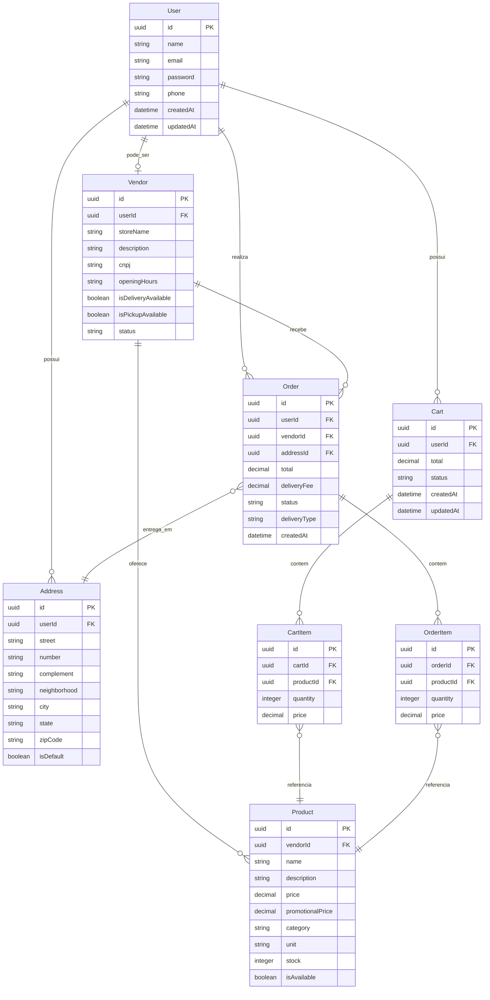

<p align="center">
  <a href="#"></a>
  <a href="#"></a>
  <a href="#"></a>
  <a href="#"></a>
  <a href="#"></a>
  <a href="#"></a>
  <a href="#"></a>
</p>

## Configuração do Projeto

```bash
npm install
```

## Compilar e Executar o Projeto

```bash
# instalar dependências
$ npm install

# desenvolvimento local (inicia o container do PostgreSQL e a aplicação)
$ npm run start:local

# modo de desenvolvimento com variáveis de ambiente locais
$ npm run start:dev

# modo de debug com variáveis de ambiente locais
$ npm run start:debug

# modo de desenvolvimento com Docker
$ npm run start:docker

# modo de produção
$ npm run start:prod
```

## Executar Testes

```bash
# testes unitários
$ npm run test

# testes e2e
$ npm run test:e2e

# cobertura de testes
$ npm run test:cov
```

## Documentação

Este projeto é baseado no [NestJS](https://docs.nestjs.com/) e segue os princípios de SOLID, DRY, KISS e Clean Architecture. A seguir, encontra-se o diagrama de classes utilizado como referência para os modelos do banco de dados.

## Diagrama de Classes

```mermaid
classDiagram
direction BT
class Address {
   text userId
   text street
   text number
   text complement
   text neighborhood
   text city
   text state
   text zipCode
   boolean isDefault
   text id
}
class Cart {
   text userId
   numeric(65,30) total
   text status
   timestamp(3) createdAt
   timestamp(3) updatedAt
   text id
}
class CartItem {
   text cartId
   text productId
   integer quantity
   numeric(65,30) price
   text id
}
class Order {
   text userId
   text vendorId
   text addressId
   numeric(65,30) total
   numeric(65,30) deliveryFee
   text status
   text deliveryType
   timestamp(3) createdAt
   text id
}
class OrderItem {
   text orderId
   text productId
   integer quantity
   numeric(65,30) price
   text id
}
class Product {
   text vendorId
   text name
   text description
   numeric(65,30) price
   numeric(65,30) promotionalPrice
   text category
   text unit
   integer stock
   boolean isAvailable
   text id
}
class User {
   text name
   text email
   text password
   text phone
   timestamp(3) createdAt
   timestamp(3) updatedAt
   text id
}
class Vendor {
   text userId
   text storeName
   text description
   text cnpj
   text openingHours
   boolean isDeliveryAvailable
   boolean isPickupAvailable
   text status
   text id
}

Address  -->  User : userId:id

Cart  -->  User : userId:id

CartItem  -->  Cart : cartId:id

CartItem  -->  Product : productId:id

Order  -->  Address : addressId:id

Order  -->  User : userId:id

Order  -->  Vendor : vendorId:id

OrderItem  -->  Order : orderId:id

OrderItem  -->  Product : productId:id

Product  -->  Vendor : vendorId:id

Vendor  -->  User : userId:id
```

## Arquitetura

Este projeto segue os princípios da Clean Architecture, com uma clara separação de responsabilidades:

- **Domain**: Contém as entidades de negócio e interfaces de repositório
- **Application**: Contém os casos de uso e DTOs
- **Infrastructure**: Implementações concretas dos repositórios
- **Presentation**: Controllers e adaptadores para a API

Isso demonstra a estrutura principal dos modelos do banco de dados, conforme o diagrama de classes proposto.

## Diagrama de Relacionamento entre Tabelas



## Documentação da API

### Swagger UI

Acessível em [http://localhost:3000/api](http://localhost:3000/api) durante o desenvolvimento

### Arquivo Swagger JSON

Gerado automaticamente na raiz do projeto (`swagger.json`) toda vez que o servidor é iniciado

### Configurações Principais

- CORS habilitado para origens específicas
- Autenticação JWT integrada
- Validação de dados com class-validator
- Tipagem RESTful padrão

## Dockerização

### Ambiente de Desenvolvimento
```bash
docker-compose up --build
```

### Ambiente de Produção
```bash
docker-compose -f docker-compose.prod.yml up --build -d
```

### Comandos Úteis
- Visualizar logs: `docker-compose logs -f backend`
- Parar containers: `docker-compose down`
- Limpar volumes: `docker-compose down -v`

## Licença

O Nest é licenciado sob a licença [MIT](https://github.com/nestjs/nest/blob/master/LICENSE).
