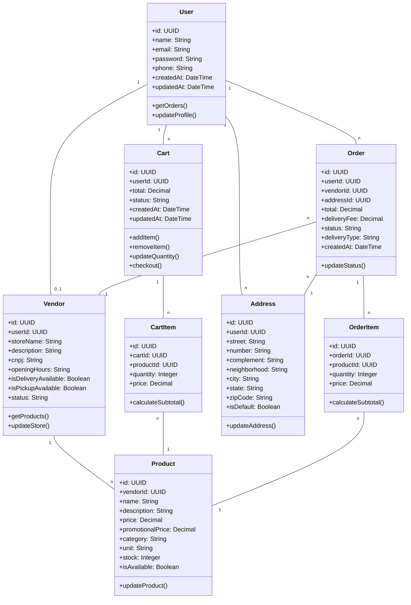
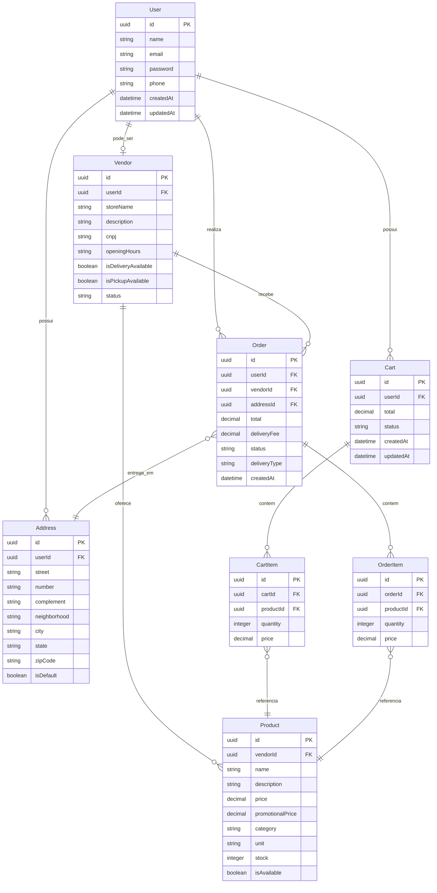

<p align="center">
  <a href="#"></a>
  <a href="#"></a>
  <a href="#"></a>
  <a href="#"></a>
  <a href="#"></a>
  <a href="#"></a>
  <a href="#"></a>
</p>

## Configuração do Projeto

```bash
npm install
```

## Compilar e Executar o Projeto

```bash
# desenvolvimento
$ npm run start

# modo de observação
$ npm run start:dev

# modo de produção
$ npm run start:prod
```

## Executar Testes

```bash
# testes unitários
$ npm run test

# testes e2e
$ npm run test:e2e

# cobertura de testes
$ npm run test:cov
```

## Documentação

Este projeto é baseado no [NestJS](https://docs.nestjs.com/) e segue os princípios de SOLID, DRY, KISS e Clean Architecture. A seguir, encontra-se o diagrama de classes utilizado como referência para os modelos do banco de dados.

## Diagrama de Classes



Isso demonstra a estrutura principal dos modelos do banco de dados, conforme o diagrama de classes proposto.

## Diagrama de Relacionamento entre Tabelas



## Documentação da API

### Swagger UI

Acessível em [http://localhost:3000/api](http://localhost:3000/api) durante o desenvolvimento

### Arquivo Swagger JSON

Gerado automaticamente na raiz do projeto (`swagger.json`) toda vez que o servidor é iniciado

### Configurações Principais

- CORS habilitado para origens específicas
- Autenticação JWT integrada
- Validação de dados com class-validator
- Tipagem RESTful padrão

## Dockerização

### Ambiente de Desenvolvimento
```bash
docker-compose up --build
```

### Ambiente de Produção
```bash
docker-compose -f docker-compose.prod.yml up --build -d
```

### Comandos Úteis
- Visualizar logs: `docker-compose logs -f backend`
- Parar containers: `docker-compose down`
- Limpar volumes: `docker-compose down -v`

## Licença

O Nest é licenciado sob a licença [MIT](https://github.com/nestjs/nest/blob/master/LICENSE).
